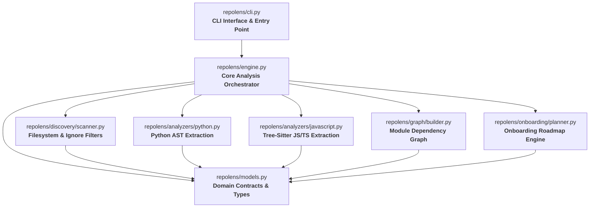

# RepoLens

<p align="center">
  <strong>Understand how a codebase works.</strong>
</p>

<p align="center">
  A local-first, evidence-based code intelligence and developer onboarding tool.<br>
  No arbitrary 0–100 scores. No runtime code execution. No LLM keys required.
</p>

<p align="center">
  <a href="https://pypi.org/project/repolens-toolkit/"></a>
  <a href="https://pypi.org/project/repolens-toolkit/"></a>
  <a href="https://github.com/deswanth12/repolens/actions/workflows/ci.yml"></a>
  <a href="https://github.com/deswanth12/repolens/releases"></a>
  <a href="https://www.python.org/"></a>
  <a href="https://opensource.org/licenses/MIT"></a>
  <a href="https://github.com/astral-sh/ruff"></a>
  <a href="https://mypy-lang.org/"></a>
  
</p>

---

## ⚡ 30-Second Quickstart

```bash
# 1. Install via pip (official PyPI package)
pip install repolens-toolkit

# 2. Understand any repository immediately
repolens /path/to/project

# 3. Get a structured contributor roadmap
repolens onboard /path/to/project
```

> **Package Name Note**: The distribution package is [`repolens-toolkit`](https://pypi.org/project/repolens-toolkit/) on PyPI, and installs the runnable command **`repolens`** into your environment.

---

## The Core Problem

> *"I just cloned this unfamiliar repository. Where do I even start?"*

When software engineers, open-source contributors, tech leads, and students approach a new codebase, they are forced to open dozens of files manually, guess where execution starts, and piece together the mental model from scratch.

Existing developer tools fail to solve this:
- **Linters & SAST tools** (`ruff`, `eslint`, `sonarqube`) point out syntax rules and security vulnerabilities, but never explain what the project actually does or how modules connect.
- **Raw dependency dumpers** (`madge`, `pydeps`) output tangled, unreadable spiderwebs of 300+ nodes without architectural context or hierarchy.
- **Architecture linters** (`import-linter`, `archunit`) require you to already understand the architecture before writing the enforcement rules.
- **LLM context dumpers** (`repomix`, AI prompt stuffers) burn thousands of tokens, hallucinate relationships, and send proprietary IP to external servers.

**RepoLens answers the essential onboarding questions using deterministic repository evidence:**
- 🚀 **Where does this application start?** (CLI entry points, web servers, background workers)
- 🗺️ **What are the foundational modules?** (Central components vs. leaf utilities)
- 🏛️ **What is the high-level architecture?** (CLI $\to$ Services $\to$ Storage $\to$ Tests)
- 🧭 **In what order should I read the code?** (A progressive, rationale-backed sequence)
- ⏱️ **What should I understand in my first 30 minutes?** (Time-boxed onboarding roadmap)
- 🤖 **Can I feed a clean repo map to AI agents?** (Structured JSON and Mermaid diagrams)

---

## Architecture at a Glance

RepoLens automatically infers modular architecture and generates native Mermaid dependency diagrams:



---

## Key Capabilities

### 1. Contributor Onboarding: "Your First 30 Minutes"
Run `repolens onboard` to get an actionable, time-boxed walkthrough designed to build a working mental model in half an hour:

```bash
repolens onboard .
```

```text
RepoLens v0.1.1 -- Contributor Onboarding: my-project
------------------------------------------------------------
YOUR FIRST 30 MINUTES
A structured, time-boxed roadmap to build a working mental model.

[0-3 min] Project Vision & Problem Statement
  Files to open: README.md, CONTRIBUTING.md
  What to understand: Understand why this project exists, who uses it, and its primary value proposition.

[3-7 min] Application Entry Point & Bootstrap
  Files to open: mycli/main.py
  What to understand: Understand where execution starts, how arguments are parsed, and how the coordinator initializes.

[7-15 min] Core Workflow & Orchestration
  Files to open: mycli/processor.py, mycli/engine.py
  What to understand: Understand the primary execution lifecycle, data pipelines, and internal task coordination.

[15-22 min] Domain Models & Core Entities
  Files to open: mycli/models.py
  What to understand: Understand the primary data representations, contracts, and internal state structures.

[22-27 min] Supporting Infrastructure & Utilities
  Files to open: mycli/utils.py, mycli/config.py
  What to understand: Understand foundational helper logic, external service adapters, and configuration loaders.

[27-30 min] Test Contracts & Behavior Verification
  Files to open: tests/test_processor.py, tests/test_cli.py
  What to understand: Understand how behaviors are verified, how to run tests locally, and how to write a test before opening a PR.
```

---

### 2. Structural Hotspots & Coupling Analysis
Connectivity is an indicator of architectural importance, not a code defect. RepoLens categorizes high-connectivity modules into actionable roles:

```bash
repolens hotspots .
```

```text
RepoLens v0.1.1 -- Structural Code Hotspots
------------------------------------------------------------------------------------------
  Module                         Coupling (In/Out)         Role / Interpretation
  repolens/models.py             26 callers / 0 imports    Foundational module: heavily relied upon across codebase
  repolens/engine.py             3 callers / 12 imports    Orchestrator: aggregates multiple internal subsystems
  repolens/discovery/scanner.py  4 callers / 3 imports     Structural nexus: high two-way connectivity
------------------------------------------------------------------------------------------
```

---

### 3. Progressive Reading Order
Rather than opening files at random, RepoLens computes a rational, sequential reading list:

```text
RECOMMENDED READING ORDER
  #   File                  Category        Why Read This
  1   README.md             Documentation   Understand the project's purpose, scope, and user-facing design.
  2   pyproject.toml        Configuration   Inspect declared dependencies, build configuration, and runnable entry points.
  3   repolens/cli.py       Entry Point     Application starting point (CLI); trace execution kickoff and wiring.
  4   repolens/models.py    Core Component  Foundational module: heavily relied upon by other modules.
  5   repolens/engine.py    Core Component  Orchestrator: aggregates multiple internal subsystems.
  6   tests/test_cli.py     Verification    Observe expected inputs, outputs, error conditions, and test contracts.
```

---

### 4. Visual Dependency Maps (`Mermaid` & `DOT`)
Export visual dependency graphs directly into your documentation or terminal:

```bash
# Generate Mermaid diagram for GitHub/Notion documentation
repolens map . > ARCHITECTURE.md

# Generate Graphviz DOT format for SVG/PNG rendering
repolens map . --format dot | dot -Tpng -o dependencies.png
```

---

### 5. Machine-Readable JSON for AI Coding Agents & CI/CD
Compress codebase context by **90%** compared to dumping raw source files into LLM prompts. Feed clean, deterministic structural metadata to AI agents (Claude, Cursor, Copilot, Antigravity):

```bash
repolens report . --format json > repo-map.json
```

```json
{
  "project_name": "repolens",
  "root_path": "/path/to/repolens",
  "languages": { "Python": 30 },
  "entry_points": [
    {
      "path": "repolens/cli.py",
      "category": "cli",
      "confidence": "high",
      "evidence": ["Configured as console script 'repolens' in pyproject.toml"]
    }
  ],
  "architecture_layers": [
    { "layer_name": "CLI / Interface", "confidence": "medium", "files": ["repolens/cli.py"] }
  ]
}
```

---

## 📦 Installation Options

### Standard Installation
```bash
# Recommended: Install from PyPI
pip install repolens-toolkit

# Using pipx (isolated application environment)
pipx install repolens-toolkit

# Using uv
uv pip install repolens-toolkit
```

### Direct Release Download
```bash
# Install directly from the official GitHub Release wheel
pip install https://github.com/deswanth12/repolens/releases/download/v0.1.1/repolens-0.1.1-py3-none-any.whl
```

### From Source
```bash
# Install latest development version from Git
pip install git+https://github.com/deswanth12/repolens.git

# Local editable installation
git clone https://github.com/deswanth12/repolens.git
cd repolens
pip install -e ".[dev]"
```

---

## 🛠️ CLI Command Reference

| Command | Usage | Description |
| :--- | :--- | :--- |
| **`repolens`** | `repolens [PATH]` | Comprehensive codebase overview (entry points, layers, hotspots, reading order). |
| **`repolens onboard`** | `repolens onboard [PATH]` | Generate the "Your First 30 Minutes" structured contributor guide. |
| **`repolens hotspots`** | `repolens hotspots [PATH]` | Inspect module connectivity table (callers, dependencies, structural role). |
| **`repolens map`** | `repolens map [PATH] [--format mermaid\|dot\|json]` | Output module dependency graph for visualization. |
| **`repolens explain`** | `repolens explain <FILE> [--repo PATH]` | Deep-dive into a specific file: extracted symbols, incoming callers, and dependencies. |
| **`repolens scan`** | `repolens scan [PATH]` | Fast file discovery pass with language distribution and category breakdown. |
| **`repolens report`** | `repolens report [PATH] [--format text\|json]` | Complete codebase understanding report. |

### Global Options
- `--json`: Output machine-readable JSON across all commands.
- `-i, --ignore <pattern>`: Add custom glob ignore patterns (e.g. `-i "legacy/**"`). Can be specified multiple times.
- `--no-gitignore`: Bypass `.gitignore` rules and include ignored files in analysis.
- `--version`: Display version information and exit.
- `--help`: Show CLI help and options.

---

## 🧩 Common Recipes

```bash
# 1. Quick overview of a new repo in your terminal
repolens .

# 2. Onboard a new team member to a monorepo service
repolens onboard packages/backend

# 3. Export dependency architecture to documentation
repolens map . --format mermaid >> docs/ARCHITECTURE.md

# 4. Investigate why a core module is frequently touched
repolens explain repolens/engine.py

# 5. Filter out third-party or vendored paths
repolens . -i "vendor/**" -i "external/**" -i "fixtures/**"

# 6. Pipe clean architecture metadata to an LLM script or CI runner
repolens report . --format json | jq '.entry_points'
```

---

## 🌐 Supported Languages

| Language | AST Symbol Extraction | Import & Dependency Resolution | Entry-Point Detection |
| :--- | :---: | :---: | :---: |
| **Python** | ✅ Native AST (`ast` stdlib) | ✅ Relative & absolute imports | ✅ High (`__main__`, CLI frameworks, `pyproject.toml`) |
| **JavaScript** | ✅ Tree-Sitter AST | ✅ ES Modules & CommonJS (`require`) | ✅ High (`package.json`, Express/Fastify/Next.js) |
| **TypeScript / TSX** | ✅ Tree-Sitter AST | ✅ ES Modules & path aliases | ✅ High (`package.json`, framework entry points) |
| **Other Languages** | ⚠️ Structural Fallback | ⚠️ Regex import pattern matching | ⚠️ Filename heuristics |

*For languages without dedicated AST parsers (such as Go, Rust, Java, C++, C#), RepoLens extracts language statistics and regex-based imports, clearly noting: `"Structural analysis is limited for this language."`*

---

## 🔒 Security & Privacy Guarantees

RepoLens was engineered with strict security boundaries:

- 🛡️ **Zero Runtime Code Execution**: RepoLens parses files strictly as static text using AST grammars. It **never** invokes `eval()`, `exec()`, `__import__()`, setup scripts, or project test suites. Untrusted code cannot execute on your machine.
- 📴 **100% Offline & Private**: Zero telemetry, zero phone-home pings, zero cloud analytics, and zero external API dependencies. RepoLens runs cleanly in air-gapped environments.
- 🔐 **Secret & Sensitive File Protection**: Automatically excludes `.env`, `*.pem`, `*.key`, `id_rsa`, and sensitive credential files from inspection.
- ⚡ **Resource Protection**: Large files ($> 2\text{ MB}$) and binary assets are safely skipped to avoid memory spikes or parsing hangs.

---

## ❓ Frequently Asked Questions (FAQ)

<details>
<summary><strong>Why is the PyPI package named <code>repolens-toolkit</code>?</strong></summary>

The PyPI distribution is named `repolens-toolkit` to avoid namespace conflicts, while the binary installed in your environment remains `repolens`. You install with `pip install repolens-toolkit` and run commands as `repolens .`.
</details>

<details>
<summary><strong>Does RepoLens execute any code from the repository?</strong></summary>

No. RepoLens uses purely static AST parsing (Python's built-in `ast` module and Tree-Sitter for JavaScript/TypeScript). It never imports or executes scanned repository code.
</details>

<details>
<summary><strong>How do I handle monorepos or subpackages?</strong></summary>

RepoLens works seamlessly with subpaths. Simply pass the path to the subpackage:
```bash
repolens services/auth
repolens onboard services/billing
```
</details>

<details>
<summary><strong>Can I integrate RepoLens into GitHub Actions?</strong></summary>

Yes! You can run RepoLens on pull requests to ensure architecture documentation remains updated or generate onboarding summaries for new contributors:
```yaml
- name: Analyze repository with RepoLens
  run: |
    pip install repolens-toolkit
    repolens onboard .
```
</details>

<details>
<summary><strong>Does RepoLens send data to OpenAI, Anthropic, or external servers?</strong></summary>

Never. RepoLens requires no API keys, makes no network calls, and collects zero telemetry. Everything runs 100% locally on your machine.
</details>

---

## 📚 Project Documentation

- [Architecture Overview](docs/ARCHITECTURE.md) — Comprehensive design and subsystem breakdowns.
- [Launch Kit](docs/LAUNCH_KIT.md) — Feature highlights, messaging, and quick demos.
- [Competitive Research](docs/COMPETITIVE_RESEARCH.md) — Detailed comparison with existing tools.
- [Known Limitations](docs/LIMITATIONS.md) — Transparent boundaries and current scope.
- [Roadmap](docs/ROADMAP.md) — Planned language parsers and future features.
- [Contributing Guide](CONTRIBUTING.md) — How to develop, test, and contribute.
- [Security Policy](SECURITY.md) — Vulnerability reporting and security models.
- [Code of Conduct](CODE_OF_CONDUCT.md) — Community standards.

---

## 📄 License

RepoLens is open-source software licensed under the [MIT License](LICENSE).
